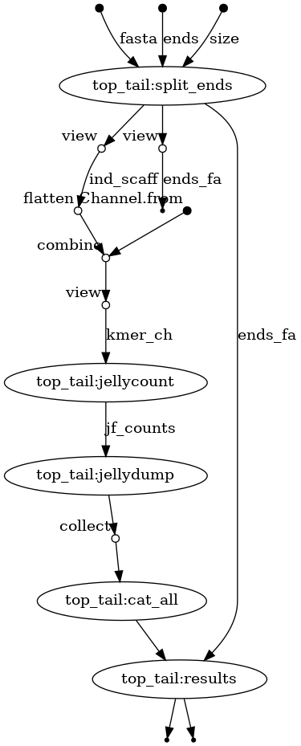

# TeloSeach

Author: Alan Tracey - GRIT - Sanger

Contributors:
@DLBPointon - Nextflow DSL2

Written to run on Sangers farm5/tol-farm


---

## Usage

### 1 - Environment set up

Activte the `curation_v2` environment, this contains the path locations of various python modules and software required for the pipeline.

### 2 - Run on the test.fa

This requires the use of a GRIT specific instalation of nextflow.

The below will run the small_test profile which runs default data.

```
bsub -e error -o out -n 1 -q small -M1500 -R'select[mem>1500] rusage[mem=1500] span[hosts=1]' '/software/grit/bin/nextflow_grit run main.nf -entry top_tail -c nextflow.conf -profile small_test'
```
## DAG of pipeline

